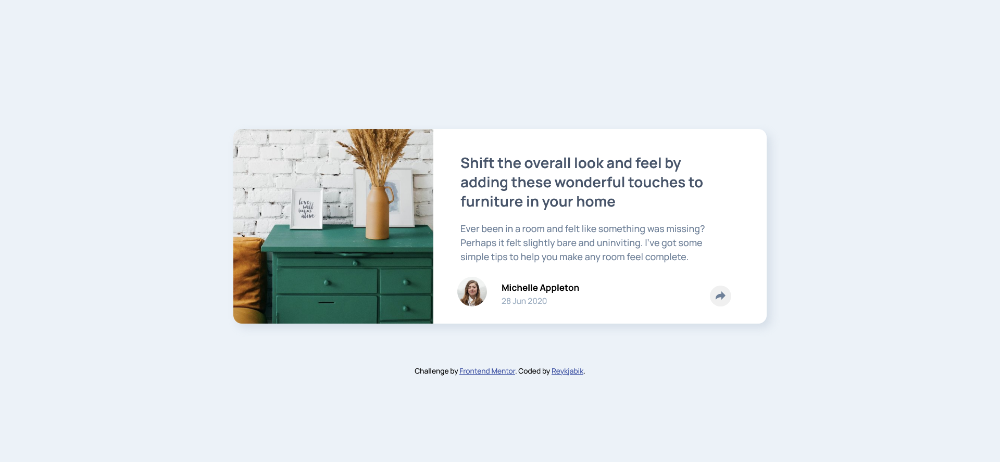

# Frontend Mentor - Article preview component solution

This is a solution to the [Article preview component challenge on Frontend Mentor](https://www.frontendmentor.io/challenges/article-preview-component-dYBN_pYFT). Frontend Mentor challenges help you improve your coding skills by building realistic projects. 

## Table of contents

- [Overview](#overview)
  - [The challenge](#the-challenge)
  - [Screenshot](#screenshot)
  - [Links](#links)
- [My process](#my-process)
  - [Built with](#built-with)
  - [What I learned](#what-i-learned)
- [Author](#author)

**Note: Delete this note and update the table of contents based on what sections you keep.**

## Overview

### The challenge

Users should be able to:

- View the optimal layout for the component depending on their device's screen size
- See the social media share links when they click the share icon

### Screenshot

### Links

- Solution URL: [Frontend Mentor Solution](https://www.frontendmentor.io/solutions/learning-grid-and-positioning-Jshm4G_sz)
- Live Site URL: [Github Page](https://reykjabik.github.io/article-preview-component/)

## My process

### Built with

- Semantic HTML5 markup
- CSS custom properties
- Flexbox
- CSS Grid
- Mobile-first workflow

### What I learned

Especially to plan carefully the structure before starting to code. This has helped me much in dealing with unexpected CSS behavious later on.

I have also started playing with some transform and shadow properties on CSS, as well as Grid. For some reason, using grid-column or grid-row was not working properly, so I had to specify the start and endings. Nor sure why, but it did the work.

## Author

- Website - [Reykjabik](https://github.com/Reykjabik)
- Frontend Mentor - [@reykjabik](https://www.frontendmentor.io/profile/Reykjabik)